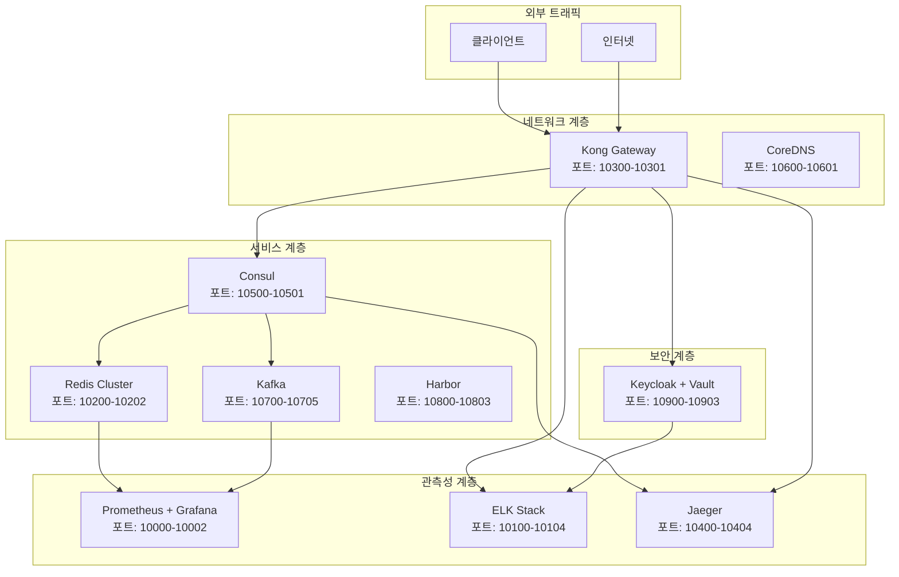

# 인프라스트럭처 애플리케이션 (infra-app)

마이크로서비스 아키텍처를 지원하는 **완전한 엔터프라이즈급 인프라스트럭처 서비스 컬렉션**입니다. 각 서비스는 독립적으로 배포 및 관리할 수 있으며, 로컬 개발 환경과 Kubernetes 클러스터 환경을 모두 지원합니다.

## 🏗️ 아키텍처 개요



## 📁 서비스 구조

```
infra-app/
├── cache/               ✅ Redis Cluster + Sentinel (완료)
├── dns/                 ✅ CoreDNS 기반 내부 DNS (완료)
├── gateway/             ✅ Kong API Gateway (완료)
├── logging/             ✅ ELK Stack 로깅 (완료)
├── messaging/           ✅ Apache Kafka Cluster (완료)
├── monitoring/          ✅ Prometheus + Grafana (완료)
├── registry/            ✅ Harbor 컨테이너 레지스트리 (완료)
├── security/            ✅ Keycloak + Vault 보안 (완료)
├── service-discovery/   ✅ Consul 서비스 디스커버리 (완료)
└── tracing/             ✅ Jaeger 분산 추적 (완료)
```

## 🌐 포트 할당 현황

| 포트 범위 | 서비스 | 주요 포트 | 설명 | 상태 |
|-----------|--------|-----------|------|------|
| **10000-10099** | **Monitoring** | 10000 (Prometheus)<br/>10001 (Grafana)<br/>10002 (AlertManager) | 메트릭 수집, 시각화, 알림 | ✅ 완료 |
| **10100-10199** | **Logging** | 10100 (Elasticsearch)<br/>10101 (Logstash)<br/>10102 (Kibana)<br/>10103 (Filebeat)<br/>10104 (Metricbeat) | 중앙화된 로그 수집 및 분석 | ✅ 완료 |
| **10200-10299** | **Cache** | 10200 (Redis Master)<br/>10201 (Redis Replica)<br/>10202 (Redis Sentinel) | 고가용성 캐시 클러스터 | ✅ 완료 |
| **10300-10399** | **Gateway** | 10300 (Kong Gateway)<br/>10301 (Kong Admin)<br/>10302 (PostgreSQL) | API 게이트웨이 및 관리 | ✅ 완료 |
| **10400-10499** | **Tracing** | 10400 (Jaeger UI)<br/>10401 (Jaeger Collector)<br/>10402 (Jaeger Query)<br/>10403 (OTEL Collector)<br/>10404 (Elasticsearch) | 분산 추적 및 관측성 | ✅ 완료 |
| **10500-10599** | **Service Discovery** | 10500 (Consul Server)<br/>10501 (Consul Client)<br/>10502 (Consul UI) | 서비스 등록 및 발견 | ✅ 완료 |
| **10600-10699** | **DNS** | 10600 (CoreDNS)<br/>10601 (DNS Metrics) | 내부 DNS 서비스 | ✅ 완료 |
| **10700-10799** | **Messaging** | 10700 (Kafka Broker 1)<br/>10701 (Kafka Broker 2)<br/>10702 (Kafka Broker 3)<br/>10703 (Kafka UI)<br/>10704 (Schema Registry) | 이벤트 스트리밍 플랫폼 | ✅ 완료 |
| **10800-10899** | **Registry** | 10800 (Harbor UI)<br/>10801 (Harbor DB)<br/>10802 (Harbor Redis)<br/>10803 (Notary) | 컨테이너 이미지 레지스트리 | ✅ 완료 |
| **10900-10999** | **Security** | 10900 (Keycloak)<br/>10901 (Keycloak DB)<br/>10902 (Vault)<br/>10903 (Vault UI) | 인증/인가 및 시크릿 관리 | ✅ 완료 |

## ✅ 완료된 서비스 목록

### 1. 🛡️ **Security (Keycloak + Vault)** - 포트 10900-10903
- **OAuth2/OIDC 인증 서버** (Keycloak 22.0)
- **시크릿 관리** (HashiCorp Vault 1.15)
- **SSO, MFA, RBAC 지원**
- **자동 초기 설정 스크립트 포함**
- **웹 UI**: http://localhost:10900 (admin/admin123), http://localhost:10902

### 2. 🌐 **Gateway (Kong)** - 포트 10300-10301
- **API Gateway** (Kong 3.4.0)
- **로드 밸런싱, 인증, 속도 제한**
- **플러그인 시스템**
- **PostgreSQL 백엔드**
- **관리 API**: http://localhost:10301

### 3. 📊 **Monitoring (Prometheus + Grafana)** - 포트 10000-10002
- **메트릭 수집** (Prometheus)
- **시각화 대시보드** (Grafana)
- **알림 시스템** (AlertManager)
- **사전 구성된 대시보드 및 알림 규칙**
- **웹 UI**: http://localhost:10001 (Grafana)

### 4. 📝 **Logging (ELK Stack)** - 포트 10100-10104
- **검색 엔진** (Elasticsearch)
- **로그 처리** (Logstash)
- **시각화** (Kibana)
- **로그 수집** (Filebeat, Metricbeat)
- **웹 UI**: http://localhost:10102

### 5. 🚀 **Cache (Redis Cluster)** - 포트 10200-10202
- **Redis Master-Replica 구조**
- **Redis Sentinel 고가용성**
- **자동 페일오버**
- **암호화된 연결**

### 6. 🔍 **Tracing (Jaeger)** - 포트 10400-10404
- **분산 추적** (Jaeger)
- **OpenTelemetry 지원**
- **Elasticsearch 백엔드**
- **실시간 추적 시각화**
- **웹 UI**: http://localhost:10400

### 7. 🔗 **Service Discovery (Consul)** - 포트 10500-10501
- **서비스 등록/발견** (Consul)
- **헬스체크 및 로드밸런싱**
- **분산 설정 관리**
- **클러스터 구성**
- **웹 UI**: http://localhost:10502

### 8. 🌐 **DNS (CoreDNS)** - 포트 10600-10601
- **내부 DNS 서비스** (CoreDNS 1.11.1)
- **서비스 디스커버리 지원**
- **커스텀 도메인 관리**
- **DNS 캐싱 및 포워딩**

### 9. 📨 **Messaging (Apache Kafka)** - 포트 10700-10705
- **이벤트 스트리밍** (Apache Kafka)
- **고가용성 클러스터 (3 브로커)**
- **Schema Registry**
- **Kafka UI 관리 도구**
- **웹 UI**: http://localhost:10703

### 10. 📦 **Registry (Harbor)** - 포트 10800-10803
- **컨테이너 이미지 레지스트리** (Harbor 2.9.0)
- **보안 스캐닝** (Trivy)
- **RBAC 권한 관리**
- **이미지 서명 및 검증**
- **웹 UI**: http://localhost:10800 (admin/Harbor12345)

## 🚀 빠른 시작 가이드

### 1️⃣ 전체 인프라 시작

```bash
# 기본 폴더로 이동
cd /Users/gossing/WorkPlace/infra-app

# 핵심 인프라 서비스 시작 (순서 중요)
echo "🔧 인프라 서비스 시작 중..."

# 1. 보안 서비스 (가장 먼저 시작)
cd security && chmod +x scripts/*.sh && docker-compose up -d && cd ..

# 2. 서비스 디스커버리
cd service-discovery && docker-compose up -d && cd ..

# 3. DNS 서비스
cd dns && docker-compose up -d && cd ..

# 4. 캐시 서비스
cd cache && docker-compose up -d && cd ..

# 5. 메시징 서비스
cd messaging && docker-compose up -d && cd ..

# 6. 모니터링 서비스
cd monitoring && docker-compose up -d && cd ..

# 7. 로깅 서비스
cd logging && docker-compose up -d && cd ..

# 8. 트레이싱 서비스
cd tracing && docker-compose up -d && cd ..

# 9. 레지스트리 서비스
cd registry && docker-compose up -d && cd ..

# 10. API 게이트웨이 (마지막)
cd gateway && docker-compose up -d && cd ..

echo "✅ 모든 인프라 서비스 시작 완료!"
```

### 2️⃣ 서비스 상태 확인

```bash
# 모든 컨테이너 상태 확인
docker ps --format "table {{.Names}}\t{{.Status}}\t{{.Ports}}"

# 서비스별 헬스체크
echo "🔍 서비스 헬스체크..."
curl -s http://localhost:10900/auth/health && echo "✅ Keycloak 정상"
curl -s http://localhost:10902/v1/sys/health && echo "✅ Vault 정상"
curl -s http://localhost:10301/status && echo "✅ Kong 정상"
curl -s http://localhost:10001/-/healthy && echo "✅ Prometheus 정상"
curl -s http://localhost:10102/api/status && echo "✅ Kibana 정상"
curl -s http://localhost:10400/api/services && echo "✅ Jaeger 정상"
```

### 3️⃣ 웹 UI 접속

```bash
# 모든 웹 UI를 브라우저에서 열기 (macOS)
open http://localhost:10900  # Keycloak
open http://localhost:10902  # Vault
open http://localhost:10001  # Grafana
open http://localhost:10102  # Kibana
open http://localhost:10400  # Jaeger
open http://localhost:10502  # Consul
open http://localhost:10703  # Kafka UI
open http://localhost:10800  # Harbor
```

## 🔧 개별 서비스 관리

### 개별 서비스 시작
```bash
# 특정 서비스만 시작
cd [service-name]
docker-compose up -d

# 로그 확인
docker-compose logs -f

# 서비스 중지
docker-compose down

# 볼륨 포함 완전 삭제
docker-compose down -v
```

### Kubernetes 배포
```bash
# 전체 배포
find . -name "k8s" -type d -exec kubectl apply -f {} \;

# 개별 서비스 배포
kubectl apply -f security/k8s/
kubectl apply -f monitoring/k8s/
kubectl apply -f logging/k8s/
# ... 나머지 서비스들

# 배포 상태 확인
kubectl get pods --all-namespaces
kubectl get services --all-namespaces
```

## 🔗 서비스 간 연동 가이드

### 인증 플로우 (Keycloak 연동)
```bash
# 1. Keycloak에서 토큰 획득
TOKEN=$(curl -s -d "client_id=api-client" \
  -d "client_secret=api-client-secret" \
  -d "username=testuser" \
  -d "password=test123" \
  -d "grant_type=password" \
  "http://localhost:10900/auth/realms/development/protocol/openid-connect/token" \
  | jq -r '.access_token')

# 2. Kong Gateway를 통한 API 호출
curl -H "Authorization: Bearer $TOKEN" \
  http://localhost:10300/api/v1/protected-resource
```

### 시크릿 관리 (Vault 연동)
```bash
# Vault에서 시크릿 조회
export VAULT_ADDR=http://localhost:10902
export VAULT_TOKEN=vault-root-token

# 애플리케이션 시크릿 조회
vault kv get secret/bank-app
vault kv get secret/sec-app
vault kv get secret/infra
```

### 서비스 디스커버리 (Consul 연동)
```bash
# 서비스 등록
curl -X PUT http://localhost:10502/v1/agent/service/register \
  -d @service-registration.json

# 서비스 조회
curl http://localhost:10502/v1/health/service/my-service
```

### 로그 및 메트릭 수집
```bash
# 애플리케이션에서 로그 전송 (Logstash)
echo '{"level":"info","message":"Test log","service":"my-app"}' | \
  nc localhost 5044

# Prometheus 메트릭 노출
curl http://localhost:9090/metrics
```

## 📊 모니터링 대시보드

### Grafana 기본 대시보드
- **시스템 개요**: http://localhost:10001/d/system-overview
- **Kong API Gateway**: http://localhost:10001/d/kong-dashboard
- **Redis 클러스터**: http://localhost:10001/d/redis-dashboard
- **Kafka 클러스터**: http://localhost:10001/d/kafka-dashboard
- **애플리케이션 메트릭**: http://localhost:10001/d/app-dashboard

### 로그 분석 (Kibana)
- **시스템 로그**: http://localhost:10102/app/discover
- **오류 분석**: http://localhost:10102/app/dashboards
- **로그 패턴**: http://localhost:10102/app/ml

### 분산 추적 (Jaeger)
- **서비스 맵**: http://localhost:10400/search
- **추적 분석**: http://localhost:10400/trace/[trace-id]

## 🛠️ 문제 해결 가이드

### 공통 문제
1. **포트 충돌 해결**
```bash
# 사용 중인 포트 확인
sudo lsof -i :10900
sudo netstat -tlnp | grep :10900

# 프로세스 종료
sudo kill -9 [PID]
```

2. **Docker 컨테이너 문제**
```bash
# 컨테이너 상태 확인
docker ps -a

# 실패한 컨테이너 로그 확인
docker logs [container-name]

# 컨테이너 재시작
docker-compose restart [service-name]
```

3. **볼륨 및 네트워크 정리**
```bash
# 사용하지 않는 볼륨 정리
docker volume prune

# 사용하지 않는 네트워크 정리
docker network prune

# 전체 정리 (주의!)
docker system prune -a
```

### 서비스별 문제 해결

#### Keycloak 문제
```bash
# 데이터베이스 연결 확인
docker exec -it keycloak-db pg_isready -U keycloak

# Keycloak 로그 확인
docker logs keycloak -f
```

#### Vault 문제
```bash
# Vault 상태 확인
vault status

# Vault 언실링 (필요시)
vault operator unseal [unseal-key]
```

#### Kong 문제
```bash
# Kong 설정 확인
curl http://localhost:10301/status

# 라우트 및 서비스 확인
curl http://localhost:10301/routes
curl http://localhost:10301/services
```

## 📚 상세 문서

각 서비스별 상세 가이드:
- 🛡️ [Security (Keycloak + Vault)](./security/README.md)
- 🌐 [Gateway (Kong)](./gateway/README.md)
- 📊 [Monitoring (Prometheus + Grafana)](./monitoring/README.md)
- 📝 [Logging (ELK Stack)](./logging/README.md)
- 🚀 [Cache (Redis)](./cache/README.md)
- 🔍 [Tracing (Jaeger)](./tracing/README.md)
- 🔗 [Service Discovery (Consul)](./service-discovery/README.md)
- 🌐 [DNS (CoreDNS)](./dns/README.md)
- 📨 [Messaging (Kafka)](./messaging/README.md)
- 📦 [Registry (Harbor)](./registry/README.md)

## 🔄 업그레이드 가이드

### 서비스 버전 업그레이드
```bash
# 백업 생성
docker-compose exec postgres pg_dump -U user db > backup.sql

# 이미지 업데이트
docker-compose pull

# 롤링 업데이트
docker-compose up -d --no-deps [service-name]
```

### 설정 변경
```bash
# 설정 파일 수정 후 서비스 재시작
docker-compose restart [service-name]

# 설정 검증
docker-compose config
```

## 🔐 보안 권장사항

### 프로덕션 환경 설정
1. **기본 패스워드 변경**
   - Keycloak: admin/admin123 → 강력한 패스워드
   - Harbor: admin/Harbor12345 → 강력한 패스워드
   - 모든 데이터베이스 패스워드 변경

2. **SSL/TLS 활성화**
   - 모든 서비스에 HTTPS 적용
   - 인증서 자동 갱신 설정

3. **네트워크 보안**
   - 불필요한 포트 외부 노출 차단
   - 방화벽 규칙 적용
   - VPN 또는 Private Network 사용

4. **접근 제어**
   - RBAC 정책 적용
   - 최소 권한 원칙
   - 정기적인 접근 권한 감사

## 📈 성능 최적화

### 리소스 할당
```yaml
# docker-compose.yml 예시
services:
  service-name:
    deploy:
      resources:
        limits:
          cpus: '2.0'
          memory: 4G
        reservations:
          cpus: '1.0'
          memory: 2G
```

### 모니터링 메트릭
- **CPU 사용률**: 80% 이하 유지
- **메모리 사용률**: 85% 이하 유지
- **디스크 I/O**: IOPS 한계 모니터링
- **네트워크**: 대역폭 사용량 추적

## 🤝 기여 가이드

### 새로운 서비스 추가
1. **폴더 구조 생성**
```bash
mkdir -p new-service/{config,k8s,scripts}
```

2. **필수 파일 생성**
```bash
touch new-service/README.md
touch new-service/docker-compose.yml
touch new-service/k8s/01-namespace-config.yaml
```

3. **포트 할당**
   - 다음 사용 가능한 포트 범위: 11000-11099

4. **문서 업데이트**
   - `rule.md`에 서비스 정보 추가
   - 메인 `README.md` 업데이트

### 코드 기여
1. **브랜치 생성**: `feature/service-name` 또는 `fix/issue-description`
2. **커밋 메시지**: `[서비스명] 기능/수정 설명`
3. **테스트**: 로컬 및 Kubernetes 환경 테스트
4. **Pull Request**: 상세한 설명과 함께 제출

---

## 📞 지원 및 연락처

- **프로젝트 문서**: [rule.md](../rule.md)
- **이슈 리포트**: GitHub Issues
- **기술 지원**: 프로젝트 메인테이너 연락

---

**🎯 현재 상태**: **모든 인프라 서비스 완료 (10/10)** ✅  
**📅 마지막 업데이트**: 2025년 5월 27일  
**🏷️ 버전**: 2.0.0  
**👥 메인테이너**: Development Team  

**🚀 다음 단계**: 개별 애플리케이션 (`bank-app`, `sec-app`) 개발 및 인프라 연동
